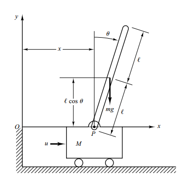
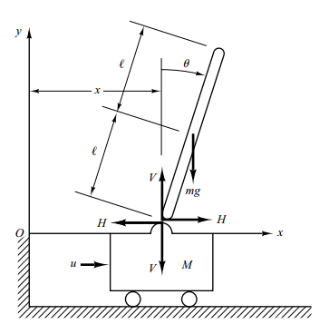

# Plant documentation

Suppose we have an inverted pendulum with a cart described in the image below. 

<figure>
    
    <figcaption>Simple inverted pendulum with cart system</figcaption>
</figure>

The control force $u$ is applied to the cart. Assume that the center of gravity of the pendulum rod is at
its geometric center. We will obtain a mathematical model for the system. To analyze the dynamics of the system, we can draw a free body diagram like image below.

<figure>
    
    <figcaption>Free body diagram of inverted pendulum system</figcaption>
</figure>

The equations that describe the motion of inverted-pendulum-on-the cart system are:

$$
(M+m)\frac{d^{2}x }{dt} + ml\frac{d^{2}\theta }{dt} = u \tag{1}
$$

$$
(I+ml^{2})\frac{d^{2}\theta }{dt}+ml\frac{d^{2}x }{dt} = mgl\theta \tag{2}
$$

We can reduce the order of ODE by introducing new variables $v$ and $\omega$

$$
\frac{dx }{dt} \tag{3} = v 
$$

$$
\frac{dv }{dt} = \frac{(I + ml^{2})u - m^{2}l^{2}g\theta}{(M+m)(I+ml^{2})-(ml)^{2}} \tag{4}
$$

$$
\frac{d\theta }{dt} = \omega \tag{5}
$$

$$
\frac{d\omega }{dt} = \frac{mlu - mgl\theta (M+m)}{(ml)^{2}-(I+ml^{2})(M+m)} \tag{6}
$$

